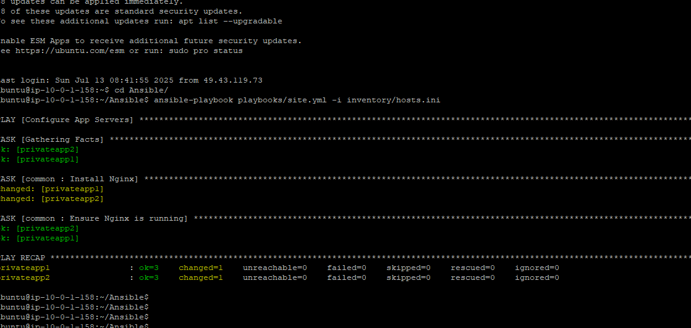
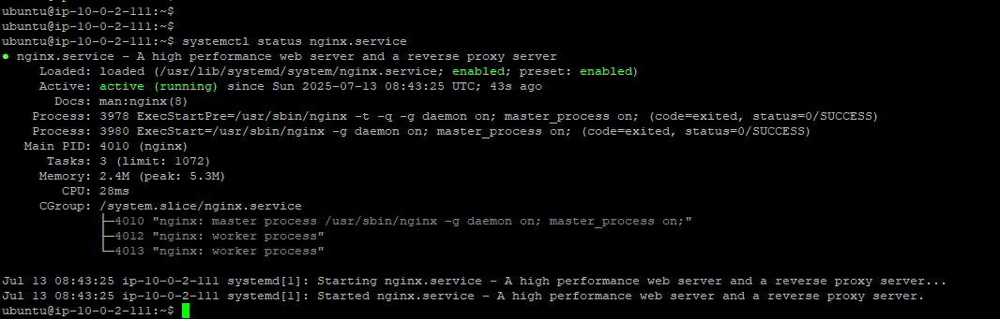

AWS VPC
├── Public Subnet
│   └── Bastion Host (Ansible Control Node)
│
└── Private Subnet
    ├── App Server 1
    └── App Server 2

    ansible-aws-project/
├── inventory/
│   └── hosts.ini
├── playbooks/
│   ├── site.yml
│   └── roles/
│       └── common/
│           ├── tasks/main.yml
│           └── handlers/main.yml
├── files/
├── templates/
├── group_vars/
│   └── all.yml
├── ansible.cfg
└── README.md

2. Step-by-Step Execution
Step A. Provision Infrastructure (manually or with Terraform)
Provision 3 EC2 instances in a VPC with:

Bastion in public subnet with a public IP.

App Servers (2) in private subnet.

Security Group Rules:

Bastion → App Servers (port 22)

Your IP → Bastion (port 22)

Key Pair: create and use for SSH from local → Bastion → App Servers.

Step B. Configure Bastion as Ansible Control Node
On the bastion:

bash
Copy
Edit
sudo apt update && sudo apt install -y ansible git
(Optional) Setup SSH forwarding to access private instances:

On your local machine:

bash
Copy
Edit
ssh -A -i my-key.pem ubuntu@<bastion-ip>
Ensure the bastion can access the internal instances via ~/.ssh/config:

ini
Copy
Edit
Host app-server-1
    HostName <private-ip-1>
    User ubuntu
    ProxyJump ubuntu@<bastion-ip>

Host app-server-2
    HostName <private-ip-2>
    User ubuntu
    ProxyJump ubuntu@<bastion-ip>
Step C. Ansible Inventory (inventory/hosts.ini)
ini
Copy
Edit
[app_servers]
app-server-1 ansible_host=<private-ip-1> ansible_user=ubuntu
app-server-2 ansible_host=<private-ip-2> ansible_user=ubuntu

[all:vars]
ansible_ssh_common_args='-o ProxyJump=ubuntu@<bastion-ip>'
Step D. Sample Playbook (playbooks/site.yml)
yaml
Copy
Edit
---
- name: Configure all app servers
  hosts: app_servers
  become: true

  roles:
    - common
Step E. Example Role (roles/common/tasks/main.yml)
yaml
Copy
Edit
---
- name: Install Nginx
  apt:
    name: nginx
    state: present
    update_cache: yes

- name: Ensure Nginx is running
  service:
    name: nginx
    state: started
    enabled: yes
🔁 GitHub Integration
Initialize local Git repo:

bash
Copy
Edit
git init
git remote add origin https://github.com/your-user/ansible-aws-project.git
git add .
git commit -m "Initial commit"
git push -u origin main
🔒 Security Considerations
Use IAM roles instead of hardcoding AWS credentials.

Restrict bastion IP access (Security Group).

Consider using AWS Systems Manager Session Manager to eliminate SSH if required.

Ansible project. This includes:

Static linting

Syntax checking

Dry run validation

Functional verification

Optional CI/CD testing setup

✅ Pre-requisites
Ensure you're working from your local machine or from the bastion host (if it's your Ansible control node), and that you have:

Python 3.x

Ansible (ansible-core, ansible-lint)

SSH access to bastion + private instances

Inventory (hosts.ini) configured with SSH proxying

🔧 STEP-BY-STEP TEST EXECUTION
🔹 Step 1: Run Ansible Lint
Validates coding style and best practices in your playbooks.

bash
Copy
Edit
ansible-lint playbooks/site.yml
❗ Run this from the root directory of your Ansible project (ansible-aws-project/).

🔹 Step 2: Syntax Check
Verifies that the YAML and Ansible syntax is valid (no runtime).

bash
Copy
Edit
ansible-playbook --syntax-check playbooks/site.yml -i inventory/hosts.ini
🔹 Step 3: Dry Run with Check Mode
Simulates the changes without applying them. Use this before applying to production.

bash
Copy
Edit
ansible-playbook playbooks/site.yml -i inventory/hosts.ini --check --diff
🔍 --check: no changes applied
📑 --diff: shows what would be changed

🔹 Step 4: Apply the Playbook (Actual Run)
Once syntax and dry run are clean:

bash
Copy
Edit
ansible-playbook playbooks/site.yml -i inventory/hosts.ini
🔹 Step 5: Functional Post-Checks (Manual or Automated)
✅ Option A: Automated in Playbook (Add in site.yml)
yaml
Copy
Edit
- name: Validate that Nginx is running
  uri:
    url: http://localhost
    status_code: 200
✅ Option B: Manual Check via Bastion
SSH into bastion → SSH into private node:

bash
Copy
Edit
ssh -J ubuntu@<bastion-ip> ubuntu@<private-ip>
curl http://localhost     # Should return HTML from Nginx
systemctl status nginx    # Should show active
🔹 Step 6: CI/CD Validation (Optional but Recommended)
Use GitHub Actions for automated test execution on every commit:

✅ .github/workflows/ansible-ci.yml
yaml
Copy
Edit
name: Ansible CI Checks

on:
  push:
  pull_request:

jobs:
  validate:
    runs-on: ubuntu-latest
    steps:
      - uses: actions/checkout@v2

      - name: Install Ansible & Lint
        run: |
          sudo apt update
          sudo apt install -y ansible ansible-lint

      - name: Lint Playbook
        run: ansible-lint playbooks/site.yml

      - name: Syntax Check
        run: ansible-playbook --syntax-check playbooks/site.yml -i inventory/hosts.ini
⚙️ Make sure your GitHub repo has the correct inventory path and test playbook available.

📂 Testing Summary Table
Phase	Command	When to Run
Linting	ansible-lint playbooks/site.yml	Every commit
Syntax Check	ansible-playbook --syntax-check	Pre-run
Dry Run	ansible-playbook --check --diff	Pre-production testing
Actual Apply	ansible-playbook	After dry run is clean
Post Verification	curl, systemctl, or uri module	Post-deployment
GitHub CI/CD	GitHub Actions YAML	All commits/PRs

🔷 Breakdown of Playbook Components
1. Play
Each YAML file can contain one or more plays. A play maps a group of hosts to tasks.

name: Optional label

hosts: The group or host this play will run against (defined in inventory)

become: Whether to use sudo/privilege escalation

2. Tasks
A list of actions to perform, executed in order. Each task typically uses a module (like apt, yum, copy, template, service).

3. Modules
Pre-built code Ansible uses to perform specific tasks (install packages, restart services, etc.)

🔷 Example 1: Installing NGINX on Ubuntu Servers
yaml
Copy
Edit
---
- name: Install and start NGINX
  hosts: webservers
  become: true

  tasks:
    - name: Install NGINX
      apt:
        name: nginx
        state: present
        update_cache: yes

    - name: Ensure NGINX is running
      service:
        name: nginx
        state: started
        enabled: true
Concepts Covered:
Using apt module for package installation

Using service module for managing systemd services

become: true enables sudo